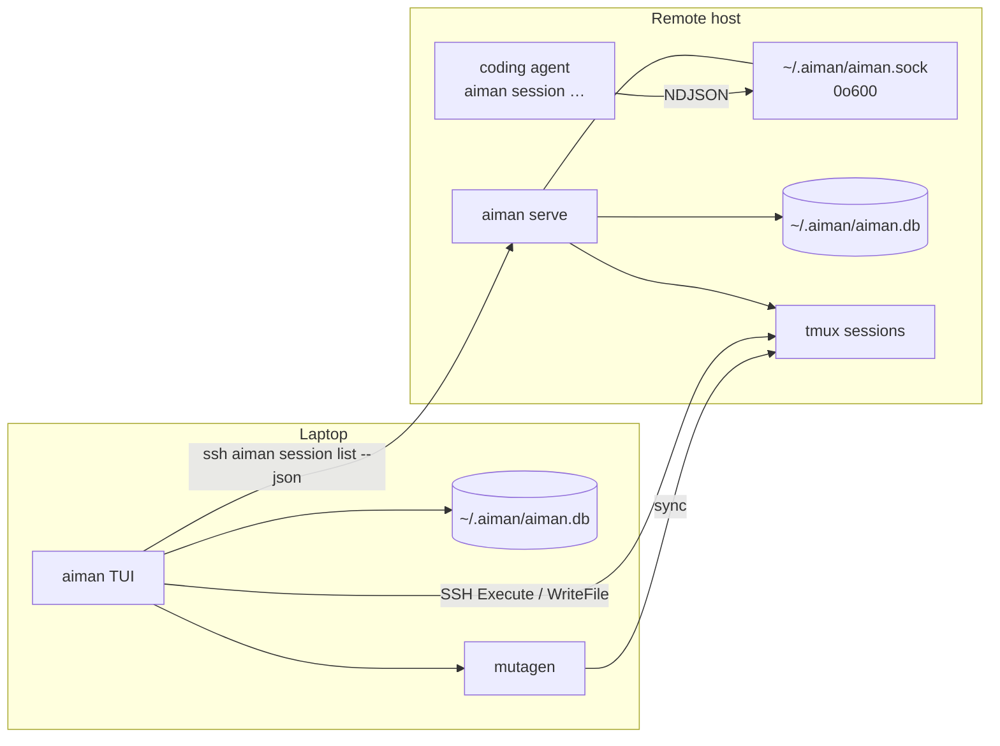
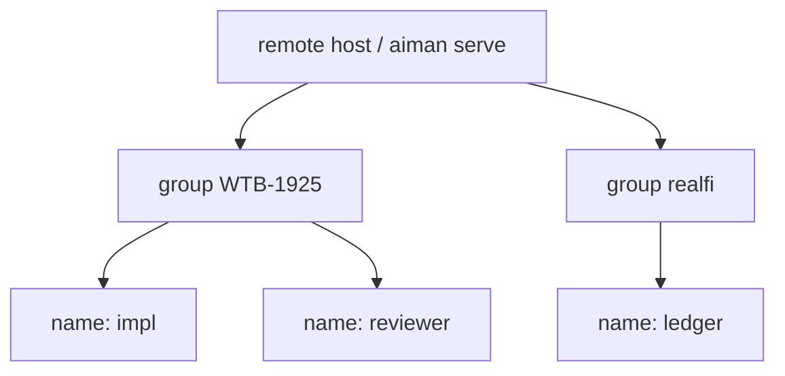

# Aiman Remote Server and Agent CLI

**Date:** 2026-08-21
**Status:** Draft (awaiting review)
**Prior art:** [herdr](https://github.com/herdrdev/herdr) agent skill, JSON CLI, Unix-socket API, workspaces (`v0.8.x`)

## Overview

Aiman's control plane is the laptop TUI. Remotes are dumb SSH + tmux hosts. An agent inside a tmux pane cannot list sibling sessions, start a helper session, or send a prompt to another agent except by hoping the TUI or `aiman-trigger` does it.

This design steals herdr's agent-native pattern (skill + JSON CLI + local socket server) and maps it onto Aiman's existing remote model. A headless `aiman serve` process runs on each remote, owns session facts for that host, and talks to tmux through `local.Executor`. The same `aiman` binary, invoked as a CLI from inside a pane, is the agent surface. A bundled `skills/aiman/SKILL.md` teaches coding agents how to use it.

The TUI stays the human UI. tmux stays the multiplexer. Mutagen, JIRA tokens, and the laptop SQLite file stay on the laptop. The server does not replace those.

Sessions also get **names** and **groups**. Today the sidebar is a flat list of `ISSUE (tmux-name)`; agents can only target a UUID. Herdr's useful bit here is not tabs or pane splits. It is a short unique alias per agent plus a workspace that rolls state up. Aiman maps those onto `Session.Name` and `Session.Group`.

## Background and Motivation

### What herdr does

Herdr is a background PTY multiplexer. Agents inside a pane drive it through:

- `HERDR_ENV=1` as a hard gate
- a Markdown skill (`herdr --skill`)
- JSON CLI (`herdr agent list|prompt|wait|start`, `herdr pane read|run`)
- NDJSON over a `0o600` Unix socket (`~/.config/herdr/herdr.sock`)

There is no MCP. The CLI is a thin wrapper over the socket. `agent.prompt --wait` is one request so prompt and wait cannot race. Semantic states are `idle` / `working` / `blocked` / `done` / `unknown`.

### What Aiman already has

| Piece | Where | Reuse |
|---|---|---|
| `FlowManager.CreateSession` | `internal/usecase/flow_manager.go` | worktree + tmux + agent launch |
| `DeliverInitialPrompt` | same | file-backed `tmux send-keys -l`, shell-safe |
| `pane.Classify` | `internal/pane/activity.go` | idle / working / waiting_input / errored / unknown |
| `SessionDiscoverer` | `internal/usecase/session_discoverer.go` | live tmux + worktree correlation |
| `AIMAN_ID` in tmux env and `<git-dir>/aiman-id` | create + discovery | session identity |
| `local.Executor` | `internal/infra/local/executor.go` | on-box `RemoteExecutor` (discovery methods are stubs today) |
| `aiman-trigger` | `cmd/aiman-trigger` | autonomous GitHub/cron poller, not an agent CLI |
| `SkillEngine.PrepareSession` | `internal/infra/skills/engine.go` | agent command + task files |

### Pain

Agents in tmux have cwd, `AIMAN_ID`, and `.aiman_*.md`. They cannot:

- list other Aiman sessions on the box
- create a new worktree + tmux session
- prompt another session and wait until it is idle or blocked
- refer to a sibling as `reviewer` instead of a UUID
- see which sessions belong to the same piece of work

The dashboard list is flat: `WTB-1925 (wtb-1925-fix-auth) [regent0]`. Two sessions on the same ticket look unrelated. Two sessions on the same branch collide in tmux names. There is no rename.

`aiman-trigger` already runs on the remote and calls `CreateSession` / `send-keys`, but it has no argv, no socket, and no JSON. Scheduled prompts live in the laptop DB, so the remote daemon never sees them.

## Goals

1. A headless server process on each remote that agents and scripts talk to.
2. An agent-facing CLI: list sessions, get one, create one, prompt one, wait on one, read one, rename one, move one between groups.
3. Short unique **names** and **groups** on every session, used by CLI targeting, the skill, and the TUI sidebar.
4. **Quick session start** from the dashboard: default remote, pick an agent, generated name, no other wizard screens. **Rename** from the dashboard and the CLI.
5. A bundled Aiman skill, gated on `AIMAN_ENV=1`, printed by `aiman --skill`.
6. Env injection so an in-pane agent can find the socket, its id, its name, and its group.
7. TUI installs and supervises `aiman serve` on remotes the same way it installs `aiman-trigger`.
8. Prompt delivery reuses the file-backed send-keys path. No interpolating prompt text into a shell string.

## Non-goals (v1)

- Replacing tmux with a custom multiplexer (herdr's actual product).
- Herdr **named sessions** (a second server socket / runtime namespace). Aiman remotes already are that namespace.
- Tab / BSP pane layout APIs. A **group** is the workspace analog: a label and a state rollup, not a layout container.
- Extra panes inside one Aiman tmux session (sibling reviewer in the same session). A helper is a **new named session in the same group**.
- HTTP, TLS, tokens, or binding a TCP port.
- MCP.
- Folding `aiman-trigger` into `serve` (later, once the socket exists).
- Creating mutagen syncs from the remote (mutagen is laptop-side).
- Pushing AWS STS or copying laptop JIRA tokens onto the remote as part of agent-create.
- Hook integrations that report native Claude/Codex session IDs (herdr's `pane.report_agent`). Nice later; not required to ship the CLI.
- Changing Bubble Tea, COALESCE Save, SSH ControlMaster, or mutagen naming.

## Key Decisions

1. **Same `aiman` binary, new subcommands.** `aiman serve` is the daemon. `aiman session …` is the client. Do not add `aiman-server` or teach agents a second binary. `aiman-trigger` stays until a later fold.
2. **Unix socket, NDJSON, mode `0o600`, no auth.** Same-user local access is the security model, matching herdr. Path: `~/.aiman/aiman.sock` (short enough for macOS socket limits).
3. **tmux remains the multiplexer.** The server sits beside it and drives it through `local.Executor`. It does not own PTYs.
4. **CLI is the agent surface; the skill only teaches the CLI.** No MCP, no tool schema. The installed binary is the syntax authority (`aiman session --help`).
5. **Always JSON on stdout for `session` commands.** Humans and agents parse the same payload. Errors are JSON on stderr, exit 1 (server/runtime) or 2 (usage).
6. **Server-owned prompt+wait.** `session.prompt` accepts an optional wait so two RPCs cannot race. Classification uses `pane.Classify`. CLI `--until blocked` is an alias for Aiman's `waiting_input`.
7. **Agent-created sessions are remote-local.** `CreateSession` via `local.Executor`: worktree + tmux + skills + prompt. No mutagen, no laptop SQLite write. The TUI discovers them later. `LocalPath` / `MutagenSyncID` stay empty until a human attaches sync from the dashboard.
8. **Serve is the source of truth on that host.** List merges remote sqlite + live tmux. After serve exists, TUI discovery prefers `ssh host aiman session list --json` and falls back to the current tmux scan.
9. **Skill lives in this repo and is embedded.** `skills/aiman/SKILL.md` plus `go:embed`. `PrepareSession` writes it into the worktree (`.agents/skills/aiman/` and `.claude/skills/aiman/`). Global `npx skills add` is optional docs, not a runtime dependency.
10. **Do not start the TUI from inside a session.** If `AIMAN_ENV=1` or stdin is not a TTY, bare `aiman` prints usage and exits 2. The skill says the same.
11. **Every session has a `Name` and a `Group`.** Name is the herdr agent-name analog: a short unique alias on that host. Group is the herdr workspace analog: a bucket of related sessions with a rolled-up state. Neither is a multiplexer object.
12. **Names are unique per host (per `aiman serve`), compared case-insensitively.** Groups are not a namespace. `aiman session prompt reviewer` is unambiguous on that box. The TUI already suffixes `[remote]` when several remotes are visible.
13. **Do not rename the tmux session when the Aiman name changes.** Identity for kill/capture remains `AIMAN_ID` and the existing `TmuxSession` string. Tmux names stay stable after create.
14. **Quick start is ad-hoc on the default remote.** No JIRA, no repo picker, no branch editor, no summary. The only interactive choice is the agent. Full wizard stays on `n`.
15. **Rename is a first-class TUI action**, not CLI-only. `e` on the selected session (`R` is already AWS credential refresh). Same validation and uniqueness as `session.rename`.

## Proposed Design

### Process model



Laptop TUI keeps using SSH for attach, pane preview, restart, and terminate. It does not become a socket client in v1 except for discovery's optional `session list` call.

### Binary and dispatch

`cmd/aiman/main.go` already switches on `os.Args[1]`. Add cases before the TUI path:

| Argv | Behaviour |
|---|---|
| `aiman` (TTY, `AIMAN_ENV` unset) | TUI (unchanged) |
| `aiman` (no TTY or `AIMAN_ENV=1`) | usage, exit 2 |
| `aiman serve` | headless server, blocks |
| `aiman --skill` | print embedded `skills/aiman/SKILL.md` |
| `aiman session …` | CLI client to the socket |
| `aiman-trigger` | unchanged separate binary |

No new module, no cobra. Hand-rolled dispatch next to `ec2_loop.go` / `clear_aws_profiles.go`.

Layout:

```
cmd/aiman/
  main.go              # dispatch
  serve.go             # aiman serve
  skill.go             # --skill
  session_cmd.go       # aiman session …
internal/server/
  server.go            # listen, accept, dispatch
  protocol.go          # request/response types
  socket.go            # path, 0o600, flock
  handlers_session.go  # list/get/create/prompt/wait/read
skills/aiman/
  SKILL.md
```

`internal/server` has no bubbletea import.

### Socket protocol

Newline-delimited JSON, one request per line, matching herdr closely enough that the skill's "parse `.result`" habit transfers.

Request:

```json
{"id":"req_1","method":"session.list","params":{}}
```

Success:

```json
{"id":"req_1","result":{"type":"session_list","sessions":[...]}}
```

Error:

```json
{"id":"req_1","error":{"code":"not_found","message":"session not found"}}
```

v1 methods:

| Method | Params | Result `type` |
|---|---|---|
| `ping` | `{}` | `pong` (includes `version`, `protocol`) |
| `session.list` | `{}` | `session_list` |
| `session.get` | `{id}` | `session` |
| `session.create` | see below | `session` |
| `session.rename` | `{id, name}` | `session` |
| `session.move` | `{id, group}` | `session` |
| `session.prompt` | `{id, text, wait?}` | `prompt_result` |
| `session.wait` | `{id, until, timeout_ms?}` | `wait_result` |
| `session.read` | `{id, lines?}` | `pane_read` |

Protocol version is an integer on `pong`. CLI refuses a server it does not understand.

Socket resolution, in order:

1. `--socket PATH`
2. `AIMAN_SOCKET_PATH`
3. `~/.aiman/aiman.sock`

Listen: `net.Listen("unix", path)`, `chmod 0600`, `flock` a sibling `aiman.sock.lock` so a second `serve` exits with `already_running`. Unlink a stale socket if the lock is free.

If the CLI finds no listener: stderr JSON `server_not_running`, exit 1. No silent fallback to raw tmux. The server is the coordination point; going around it reintroduces the send-keys races we are trying to kill.

### Names and groups

Word mapping (do not import herdr's names into Aiman APIs):

| Herdr | Aiman | What it is |
|---|---|---|
| Named session (`herdr --session work`) | A remote + `aiman serve` | Separate server namespace, own socket |
| Workspace | **Group** | Bucket of related sessions; sidebar rollup |
| Agent name (`reviewer`) | **Session name** | Short unique alias for one worktree+tmux+agent |
| Pane / tab | (not in v1) | Layout; Aiman still uses one tmux session per unit |



**Name** (`Session.Name`):

- Charset: `^[A-Za-z][A-Za-z0-9_-]{0,47}$` so JIRA keys like `WTB-1925` fit. No dots or colons (those are tmux target punctuation; names are not tmux names, but we keep the set boring).
- Unique among sessions on that host, compared case-insensitively. Collision → `name_taken`.
- CLI targets accept, in order: exact name (case-insensitive), `group/name`, UUID, tmux session name. Ambiguous `group/name` vs a name that contains a slash cannot happen (slash is not in the charset).
- Not the tmux session name. Renaming does not call `tmux rename-session`.

**Group** (`Session.Group`):

- Same charset. Empty is stored as `ungrouped`.
- Not unique. Many sessions share a group.
- No `groups` table in v1. The group is a string on the session. Title, order, and collapse state can wait until a third consumer needs them.
- List is a flat JSON array with `name` and `group` on each row, sorted by `group` then `name`. `session list --group WTB-1925` filters. The TUI groups in render and rolls state up.

**Auto-assign on create** (TUI wizard and `session create`):

| Field | `--flag` / quick start | Else |
|---|---|---|
| Group | `--group`; `--quick` and TUI `N` force `quick` | issue key; else repo short name (`realfi` from `owner/realfi`); else `ungrouped` |
| Name | `--name` if unique; `--quick` / TUI `N` use first free `q1`, `q2`, … | `impl` if that is free in this group; else sanitized branch; else `{base}-2`, `{base}-3` |

Full TUI `n` create does not add a name field to the wizard. It uses the table above. Quick start always generates `q{n}`. Agent-created helpers pass `--name reviewer --group "$AIMAN_GROUP"` so they land next to the caller.

**Backfill:** when serve (or TUI save) sees an empty name, it persists a derived one using the same table. Empty group becomes issue key, else repo short name, else `ungrouped`. COALESCE Save must keep a non-empty name/group; discovery must not blank them.

**State rollup** (TUI group header, optional `groups` summary later):

| Any child is | Group shows |
|---|---|
| `waiting_input` | `waiting_input` |
| else `errored` | `errored` |
| else `working` | `working` |
| else `idle` / `unknown` | `idle` |

Same idea as herdr's workspace sidebar: look at the group that needs a decision, not every row.

**Tmux uniqueness:** `CreateSession` today names tmux after the sanitized branch, so two sessions on the same branch fail. After names exist, the tmux session name is `SanitizeTmuxSessionName(name)` when that string is free, otherwise `SanitizeTmuxSessionName(name + "-" + first 8 of id)`. Existing sessions keep their current tmux name.

### Quick session start

The full `n` wizard is eight screens (run target, mode, issue/branch/repo/dir, agent, summary). Quick start is one choice, then go.

| | Full (`n`) | Quick (`N`) |
|---|---|---|
| Remote | run-target picker | `ActiveRemote`, else `remotes[0]`; if the dashboard remote filter is set, that host |
| Mode | JIRA / branch / existing / ad-hoc / autonomous | ad-hoc, `PromptFree: true` |
| Name | auto `impl` / issue / branch | generated `q1`, `q2`, … unique on that host |
| Group | issue key / repo / `ungrouped` | `quick` |
| Agent | picker after dir | **the only picker** |
| Summary / AWS / prompt | yes | skipped; AWS defaults from `ResolveAWSSessionDefaults` if the remote has a syncing delegation |
| Mutagen | yes (laptop TUI path) | yes (same `startBackgroundCreate`) |
| Git worktree | yes unless ad-hoc | no: ad-hoc dir `{root}/{name}` as `CreateSession` already does |

Key: `N` (shift+n), next to `n` in the help footer: `N` quick session. Esc from the agent picker returns to the dashboard, not the mode picker.

No remotes configured: stay on the dashboard, footer error `no remote configured`. Do not open the picker.

Generated names: in group `quick`, the first free `q{n}` for n = 1, 2, … (`q1`, `q2`). Charset-legal, short, unique. `Branch` (ad-hoc directory label) is set to the same string. User renames afterwards.

CLI equivalent (for the skill, and for scripts):

```
aiman session create --quick --agent claude
```

That is `--group quick`, auto `q{n}`, ad-hoc, current host (serve already runs there). `--agent` is required. `--name` still overrides the generated id.

Placeholder in the session list uses `Name` (`q1`), not `"new session"`.

### Rename

CLI (already in the method table): `aiman session rename <target> NEW-NAME`.

TUI: `e` on the selected dashboard row (`R` is AWS refresh). Reuse `TextInputModel` (`internal/ui/text_input.go`): prompt `Rename session`, initial value is the current `Name` (or the derived backfill if empty). Enter validates charset and per-host uniqueness, then:

1. `db.Save` on the laptop (COALESCE keeps the new name).
2. If `aiman serve` is reachable on that session's host, also `aiman session rename` over SSH so the remote catalog matches. Failure here is a warning, not a rollback: the TUI already shows the new name.

`r` stays "refresh status". `R` stays AWS credential refresh. `e` is rename. Do not `tmux rename-session`.

Invalid name: keep the input view, show the error under the box (`name_taken` or charset). Esc cancels.

### Session JSON

One shape for list, get, create, rename, and move:

```json
{
  "id": "uuid",
  "name": "impl",
  "group": "WTB-1925",
  "issue_key": "PROJ-123",
  "branch": "proj-123-fix-auth",
  "repo_name": "owner/repo",
  "tmux_session": "impl",
  "worktree_path": "/home/dev/src/repo@proj-123-fix-auth",
  "working_directory": "/home/dev/src/repo@proj-123-fix-auth",
  "agent_name": "claude",
  "status": "ACTIVE",
  "state": "working",
  "state_confidence": "high",
  "self": false
}
```

`self` is true when `id` equals the caller's `AIMAN_ID`. `state` is `pane.Classify` mapped as:

| `domain.AgentState` | CLI / JSON |
|---|---|
| `idle` | `idle` |
| `working` | `working` |
| `waiting_input` | `waiting_input` (`blocked` accepted as input alias) |
| `errored` | `errored` |
| `unknown` | `unknown` |

Do not invent herdr's `done` / seen-in-UI bit in v1. Aiman has no "user looked at this pane" signal that is trustworthy on a headless remote.

### CLI

```
aiman session list [--group GROUP]
aiman session get <target>
aiman session create --repo owner/repo --branch NAME --agent claude \
    [--name NAME] [--group GROUP] \
    [--dir SUBDIR] [--prompt TEXT] [--issue KEY] [--base BRANCH] [--existing]
aiman session create --quick --agent claude [--name NAME]
aiman session rename <target> NEW-NAME
aiman session move <target> --group GROUP
aiman session prompt <target> TEXT [--wait] [--until STATE] [--timeout 120s]
aiman session wait <target> [--until idle|working|waiting_input|blocked] [--timeout 120s]
aiman session read <target> [--lines 120]
```

`<target>` is name, `group/name`, UUID, or tmux session name. The server resolves in that order. `name_taken` and `not_found` are the collision/miss errors.

`--wait` on prompt means: send, then wait until the first of `idle` | `waiting_input` | `errored`. Default timeout 120s (herdr defaults to indefinite; Aiman agents hang for tens of minutes, so a default timeout is safer; `--timeout 0` means no limit).

Prompt text is a single argv string. For long text, `--prompt-file PATH` reads bytes and sends those. The server still writes a temp file and uses `send-keys -l -- "$(cat …)"`.

Create flags map onto `domain.SessionConfig`:

| Flag | Field |
|---|---|
| `--name` | `Name` (optional; auto-assign if omitted) |
| `--group` | `Group` (optional; auto-assign if omitted) |
| `--repo` | `Repo.Name` / URL inferred as `https://github.com/<name>.git` |
| `--branch` | `Branch` |
| `--agent` | `Agent.Name` (must be on `agent.KnownAgents()` or scanned PATH) |
| `--dir` | `Directory` |
| `--prompt` | `InitialPrompt` |
| `--issue` | `IssueKey`; resolved via remote JIRA config if present, else error `jira_unavailable` |
| `--base` | `BaseBranch` |
| `--existing` | `ExistingBranch` |
| `--quick` | ad-hoc + group `quick` + generated `q{n}` (requires `--agent`) |

`--issue` is optional. Agents spawning a helper already know repo and branch. If JIRA config is missing on the remote, create without an issue still works.

Create does **not** take AWS, secrets, mutagen, or OpenRouter flags in v1. Those remain TUI/laptop concerns. The new session inherits whatever AWS files already exist in the remote `~/.aws` (same as a TUI-created session after credentials have been pushed).

### Server internals

`aiman serve` boots:

1. `config.Load()` from `~/.aiman/config.yaml` (may be sparse on a remote)
2. `sqlite.NewRepository` at `config.GetDBPath()`
3. `local.NewExecutor(cfg.Remotes[0].Root)` or `$HOME` / config `server.root`
4. `skills.NewEngine`, `git.NewManager`, `FlowManager` with that local executor
5. listen on the socket
6. on accept: decode one JSON line, handle, write one JSON line. Sequential per connection is enough. Concurrent connections are allowed; `session.prompt` against the same tmux target is serialized with a per-session mutex so two agents cannot interleave send-keys.

`local.Executor` today stubs `ScanTmuxSessions`, `ScanGitRepos`, `ScanWorktrees`, and has no `BatchDiscovery`. PR1 implements the same shell used by `ssh.Manager` (`internal/infra/ssh/discovery.go`) on the local executor so `SessionDiscoverer.Discover` works on-box. That is the whole point of `BatchDiscovery`: the scripts are already remote-side.

List handler:

1. `Discover` live tmux/worktrees
2. `db.List` for this host
3. merge with the same COALESCE rules as `Model.applyDiscoveryResult` (prefer non-empty DB fields; live state wins for tmux presence and cwd)

Get: that merge, then `pane.Classify` on a captured pane.

Read: `CaptureTmuxPane` (or `tmux capture-pane -p -S -<lines>`), return text. Do not gzip. The TUI snapshot path stays separate.

Prompt: extract a `SendPrompt` from `DeliverInitialPrompt`. For a live session skip the "wait until pane command is not bash" startup loop; still use the temp-file + `send-keys -l` path. Reject if current state is `waiting_input` unless `--force` (herdr's `agent_blocked`). Optional wait is the same code as `session.wait`.

Wait: poll `pane.Classify` every 500ms until `until` matches or timeout. Capture only `StatusLines`/`TailLines` worth, not the full history.

Create: assign name/group, `FlowManager.CreateSession` then `db.Save`. Mutagen is not started. Return the session JSON. Failures return `create_failed` with the wrapped error string. `name_taken` is returned before CreateSession runs.

Rename/move: validate charset, uniqueness (rename only), `db.Save`. Do not touch tmux. Return the session JSON.

### Env injection

`CreateSession` already injects `AIMAN_ID` via `tmux -e`. Add, via `tmuxEnvFlags`, values the skill needs. These are authoritative (cannot be overridden by `EnvSecrets`):

| Env | Value |
|---|---|
| `AIMAN_ENV` | `1` |
| `AIMAN_ID` | session UUID (already) |
| `AIMAN_SESSION_ID` | same UUID (skill-friendly alias) |
| `AIMAN_SESSION_NAME` | `Session.Name` |
| `AIMAN_GROUP` | `Session.Group` |
| `AIMAN_SOCKET_PATH` | `~/.aiman/aiman.sock` expanded |
| `AIMAN_BIN_PATH` | absolute path of the running `aiman` binary |

Restart (`Model.restartSession`) must inject the same set. Today it already sets `AIMAN_ID`.

`AIMAN_ENV=1` is also the nested-TUI guard.

### Skill

`skills/aiman/SKILL.md` is the agent-facing contract. Shape copied from herdr, content Aiman-specific:

- Frontmatter `name: aiman`, description requiring `AIMAN_ENV=1`
- Gate: `test "${AIMAN_ENV:-}" = 1` or stop
- Learn CLI from `aiman session --help`; do not run bare `aiman`
- List / get / create / rename / move / prompt --wait / wait / read
- Prefer names over UUIDs. Spawn helpers with `--name <role> --group "$AIMAN_GROUP"`
- Prefer `AIMAN_SESSION_NAME` / `AIMAN_GROUP` as caller context; never target the UI-focused session (there is none on the remote)
- Parse `name`, `group`, and `id` from JSON
- Do not `serve` stop, do not kill tmux sessions the agent did not create, unless the user asked
- Create a helper as a **new named session in the same group** (new branch/worktree), not a pane split. `aiman session create --quick --agent <kind>` is the no-repo shortcut.

`aiman --skill` prints this file from `go:embed`. CLI `--help` footer for `session` points agents at `aiman --skill`.

`PrepareSession` writes the skill into the worktree:

- `.agents/skills/aiman/SKILL.md`
- `.claude/skills/aiman/SKILL.md`

Both are gitignored by the existing `EnsureAimanSessionFilesGitignored` rules (extend that helper). Do not install into `~/.claude` globally from serve; worktree-local is enough and does not surprise other projects on the box.

### TUI install and supervise

Today `ensureRemoteDaemon` curls `install.sh` with `BINARY_NAME=aiman-trigger`. Add `ensureRemoteServer`:

1. Install `aiman` onto the remote (`install.sh` default `BINARY_NAME=aiman`)
2. Start `aiman serve` if the socket is dead

Keep-alive: a tmux session named `aiman-serve` running `aiman serve`, matching how the Daemons tab already launches `aiman-trigger`. systemd user units are a later nicety, not v1.

Doctor / splash: a check "remote serve reachable" that runs `aiman session list` over SSH or `ssh host test -S ~/.aiman/aiman.sock`. Failure is a warning, not a hard gate. Agents on a box without serve just cannot use the skill; existing TUI flows keep working.

Discovery: try `ssh host "$AIMAN_BIN" session list` (or `~/.local/bin/aiman session list`). If that fails, current `SessionDiscoverer` path. Merge still uses COALESCE Save so empty live fields cannot wipe laptop-known Branch/AgentName.

Agent-created sessions therefore show up in the TUI on the next discovery cycle, with `MutagenSyncID` empty. Dashboard already handles sessions without sync (Ctrl+Y recreate). No new TUI wizard for "adopt this session" in v1.

Sidebar (`item.Title` today: `ISSUE (tmux) [remote]`) becomes a grouped list. Non-selectable header rows show `group` plus rolled-up state. Child rows show `name` then agent and activity. The existing `[remote]` tag stays on the header when more than one remote is in the list. `FilterValue` includes name, group, issue key, tmux name, repo, remote. No new wizard field for name/group on the full `n` flow; that path still auto-assigns. Quick start (`N`) and rename (`R`) are the TUI surfaces for generated and edited names. `g` to move groups remains later.

### `aiman-trigger`

Leave it. It polls GitHub and cron. After v1, a follow-up can run those loops inside `serve` and stop shipping a second binary. Do not block the agent CLI on that cleanup.

The daemon's interpolating `tmux send-keys -t %q %q Enter` in `triggerPrompt` / `monitorPanes` is a known footgun. `session.prompt` must not copy it. A later PR can point the daemon at `SendPrompt`.

## API / Interface Changes

No change to `domain.RemoteExecutor` besides implementing the missing methods on `local.Executor`.

New exported helper (same package as `DeliverInitialPrompt`):

```go
// SendPrompt types text into an already-running tmux session using the
// file-backed send-keys path. It does not wait for agent startup.
func SendPrompt(ctx context.Context, remote promptDeliverer, tmuxName, sessionID, prompt string) error
```

`DeliverInitialPrompt` keeps the startup wait + agy trust dialog and then calls `SendPrompt`.

No new domain interface for the server. Handlers take `*usecase.FlowManager`, `domain.SessionRepository`, and `domain.RemoteExecutor` as concrete fields on `server.Server`.

## Data Model Changes

`domain.Session` and `domain.SessionConfig` gain:

```go
Name  string // unique per host, charset ^[A-Za-z][A-Za-z0-9_-]{0,47}$
Group string // bucket; empty persists as "ungrouped"
```

SQLite (laptop and remote, same file format):

```sql
ALTER TABLE sessions ADD COLUMN name TEXT;
ALTER TABLE sessions ADD COLUMN group_name TEXT; -- "group" is a SQL keyword
```

Same `ALTER TABLE … ADD COLUMN` pattern as `agent_model` / `mode` in `internal/infra/sqlite/repository.go`. Normalise NULL to `''` on open, then backfill empty names/groups on the next Save.

`Save` COALESCE:

```sql
name = COALESCE(NULLIF(excluded.name, ''), sessions.name),
group_name = COALESCE(NULLIF(excluded.group_name, ''), sessions.group_name),
```

Do not add a `groups` table in v1. No unique index on `name` in SQLite: uniqueness is per host and the laptop DB holds several remotes. The server enforces uniqueness for the host it owns. The TUI qualifies collisions across remotes with `[remote]`.

No other schema changes. Session facts that must survive a tmux restart already live on `sessions` and `<git-dir>/aiman-id`.

## Security

Threat model: anything running as the remote user can talk to the socket. That is the same user as the agents and as `tmux`. A compromised agent can list, prompt, and create sessions as that user. That is the feature.

Mitigations:

- Socket `0o600`, no TCP
- `flock` so only one serve
- Prompt bytes never enter a shell command line
- Create cannot pass secrets or AWS overrides in v1
- Skill refuses to operate without `AIMAN_ENV=1` so a laptop agent does not drive a remote socket by accident
- Bare `aiman` inside a session does not take over the pane as a TUI

Do not log prompt bodies. Log session id, method, duration, error code.

## Observability

`aiman serve` logs to `~/.aiman/serve.log` (0600) and stderr. One line per request: `id method code dur_ms`. CLI writes nothing to stdout except the JSON result.

No metrics in v1.

## Rollout

1. Ship the CLI + serve in the `aiman` binary. Harmless on laptops (nobody runs `serve` there).
2. TUI `ensureRemoteServer` behind the existing Daemons/provision path so existing remotes get the binary on next dashboard open (or an explicit "install serve" action).
3. New sessions get env + skill files. Old sessions get them on restart (`s` key).
4. Rollback: stop `aiman-serve` tmux, delete the socket. TUI and tmux sessions keep running. Skill becomes a no-op besides "server_not_running".

## Alternatives Considered

### A. HTTP on localhost

Agents already know curl. Rejected: another port to collide, needless HTTP stack, and herdr's lesson is that a Unix socket plus a CLI is the whole product. Revisit only if we need a non-same-user client.

### B. No server: CLI talks to tmux directly

`aiman session prompt` could `tmux send-keys` without a daemon. Rejected: no serialization, no wait that is consistent across callers, no create that can `Save` safely, and two agents prompting the same pane will interleave. The server is the mutex and the classifier.

### C. Third binary `aiman-server`; keep `aiman` TUI-only

Matches today's `aiman-trigger` split. Rejected: agents need the CLI on PATH; installing two binaries and teaching two names is the failure mode herdr avoided. One binary, many subcommands.

### D. Make the laptop TUI the server; CLI on remote SSHs back

Would let create run mutagen. Rejected: agents must work when the laptop lid is closed (the whole point of remotes). Herdr's remote story is "SSH in, talk to the server on that box."

### E. Steal pane split and `agent start` into an existing tmux session

Useful later for orchestrator/reviewer in one worktree. Out of v1 because Aiman's unit is already one worktree + one tmux session, and `CreateSession` is the path we trust. A helper is a new named session in the same group.

### F. First-class `groups` table with title, order, collapse

Rejected for v1: one string on the session covers list, filter, TUI headers, and rollup. A table earns its keep when we have group metadata that is not a session field.

### G. Unique names per group, CLI always `group/name`

Rejected: `aiman session prompt reviewer` should work. Group is organisation, not a namespace. `group/name` is still accepted as a target. Cross-remote collisions are a TUI display problem (`[remote]`), not a CLI one.

### H. Herdr named sessions (`herdr --session work`, extra sockets)

Rejected: that is a second server. Aiman already splits runtime by remote host. Do not add `~/.aiman/sessions/<name>/aiman.sock`.

### I. Quick start as mode `6` on the existing `n` wizard

Rejected: that still forces the run-target screen. The point is one key, one picker. `n` stays the full flow.

### J. Quick start reuses `r` for rename

Rejected: `r` is refresh. `R` is rename. `N` is quick start.

## Risks

| Risk | Severity | Mitigation |
|---|---|---|
| Split-brain: laptop DB vs remote DB | High | TUI discovery prefers `session list`; Save COALESCE stays; agent-create does not write the laptop DB |
| `local.Executor` discovery stubs make list empty | High | PR1 implements the ssh discovery scripts on local |
| Agent-create without mutagen surprises humans | Medium | Empty sync is already a dashboard state; Ctrl+Y attaches later |
| `--issue` on a remote with no JIRA token | Low | Optional flag; `jira_unavailable` |
| Prompt to a blocked agent clobbers a y/n UI | High | Reject `waiting_input` unless `--force` |
| Old sessions lack `AIMAN_ENV` / skill files | Medium | Inject on restart; skill says to stop if the gate fails |
| Empty historical name/group, discovery blanks them | High | COALESCE on `name` / `group_name`; backfill on first serve/TUI save |
| Name collision across remotes in the TUI | Low | Uniqueness is per host; TUI shows `[remote]` on the group header |
| Two sessions, same branch, tmux name clash | Medium | Tmux name uses `SanitizeTmuxSessionName(name)` plus short id fallback |
| `aiman serve` dies | Medium | tmux `remain-on-exit` + TUI ensure; CLI errors `server_not_running` |

## Open Questions

These do not block writing PR1. They do fork later PRs. Defaults in this spec:

1. **Create from an agent: new branch/worktree (this spec) vs attach to an existing session's worktree with a second tmux session.** v1 is a new named session in the same group.
2. **Should `ensureRemoteServer` run automatically on dashboard start, or only from the Daemons tab?** Automatic, same as trigger.
3. **Default prompt wait timeout 120s vs indefinite.** 120s, `--timeout 0` for no limit.
4. **Default remote when several remotes exist and `active_remote` is empty?** `remotes[0]`. The dashboard `f` filter overrides when set.
5. **Quick start with no agents on the remote?** Same empty-picker copy as today; Esc back to the dashboard. Do not create a session.

## References

- https://github.com/herdrdev/herdr/blob/master/skills/herdr/SKILL.md
- https://herdr.dev/docs/socket-api/
- https://herdr.dev/docs/agent-skill/
- `internal/usecase/flow_manager.go` (`CreateSession`, `DeliverInitialPrompt`)
- `internal/pane/activity.go` (`Classify`)
- `internal/usecase/session_discoverer.go`
- `internal/infra/local/executor.go`
- `cmd/aiman-trigger/main.go`
- `docs/superpowers/specs/2026-06-08-session-initial-prompt-design.md`

## PR Plan

### PR 1: Socket server, ping, session list, names/groups on the model

**Title:** `feat: add aiman serve and session list over a unix socket`

**Files:** `cmd/aiman/main.go`, `cmd/aiman/serve.go`, `internal/server/*`, `internal/domain/session.go`, `internal/infra/sqlite/repository.go`, `internal/infra/local/executor.go` (implement discovery), tests for protocol, list merge, name uniqueness, COALESCE on `name`/`group_name`.

**Depends on:** nothing.

**Changes:** listen/accept/NDJSON; `ping`; `Session.Name` / `Session.Group` columns; `session.list` / `session.get` via on-box `SessionDiscoverer` + sqlite with backfill; CLI `aiman session list|get` (`--group` filter); `AIMAN_ENV` / no-TTY guard on bare `aiman`. No create, prompt, or skill yet.

### PR 2: Read, prompt, wait

**Title:** `feat: session read/prompt/wait with file-backed send-keys`

**Files:** `internal/usecase/flow_manager.go` (`SendPrompt`), `internal/server/handlers_session.go`, `internal/pane` (already), CLI, tests that do not interpolate prompts.

**Depends on:** PR 1.

**Changes:** `session.read`, `session.prompt` (reject `waiting_input`, optional wait), `session.wait`. Reuse `pane.Classify`.

### PR 3: session create, rename, move

**Title:** `feat: aiman session create/rename/move with names and groups`

**Files:** `internal/server`, `cmd/aiman/session_cmd.go`, `internal/usecase/flow_manager.go` (tmux name from session name), name/group assign helper + tests.

**Depends on:** PR 1 (list must show the new row). Prompt from PR 2 is used for `--prompt`.

**Changes:** `session.create` with `--name`/`--group` auto-assign and `--quick`; uniqueness; tmux name from `SanitizeTmuxSessionName(name)` plus short-id fallback; `session.rename`; `session.move`; `db.Save`. Remote-agent create still has no mutagen. JSON result.

### PR 4: Skill and env injection

**Title:** `feat: bundle aiman agent skill and inject AIMAN_* env`

**Files:** `skills/aiman/SKILL.md`, embed, `aiman --skill`, `PrepareSession` copies into worktree, `tmuxEnvFlags` / restart path, gitignore helper, help footer.

**Depends on:** PR 1–3 so the skill documents real commands.

**Changes:** skill file (spawn helpers with `--name` `--group "$AIMAN_GROUP"`), env including `AIMAN_SESSION_NAME` and `AIMAN_GROUP`, worktree install. Existing sessions pick this up on restart.

### PR 5: TUI grouped sidebar, install serve, discover via list

**Title:** `feat: group the session sidebar and install aiman serve on remotes`

**Files:** `internal/ui/dashboard.go` (`item.Title`, grouped list items, `ensureRemoteServer`), provisioner optional step, `session_discoverer` or dashboard discovery command, doctor check.

**Depends on:** PR 1–4.

**Changes:** remote install of `aiman`, tmux `aiman-serve`, discovery tries `aiman session list --json` over SSH, sidebar grouped by `Group` with rolled-up state, child rows show `Name`.

### PR 6: TUI quick start and rename

**Title:** `feat: quick session start and dashboard rename`

**Files:** `internal/ui/dashboard.go` (`N`, `R`, help bindings), `internal/ui/creating_session.go` (placeholder uses `Name`), agent-picker back-target, `TextInputModel` for rename, tests in `internal/ui/dashboard_test.go` / `creating_session_test.go` / `run_target_picker_test.go`.

**Depends on:** PR 1 (Name/Group columns and assign helper). Does **not** depend on serve: laptop `CreateSession` + `db.Save`. After PR 3, rename also forwards to `aiman session rename` when serve is up.

**Changes:** `N` scans agents on the default remote, picker, Enter starts an ad-hoc session named `q{n}` in group `quick`, skips summary. `R` renames the selected session. `n` wizard unchanged.

### Later (not this slice)

- Fold `aiman-trigger` into `serve`
- Point daemon send-keys at `SendPrompt`
- TUI `g` move-group key
- `--attach-worktree` / sibling tmux in the same worktree
- `groups` table if we need titles and order independent of sessions
- `--attach-worktree` / sibling tmux in the same worktree
- Hook-based agent lifecycle (herdr `pane.report_agent`)
- systemd user unit
